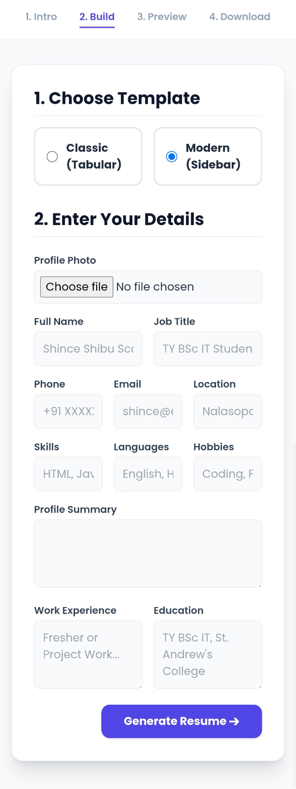
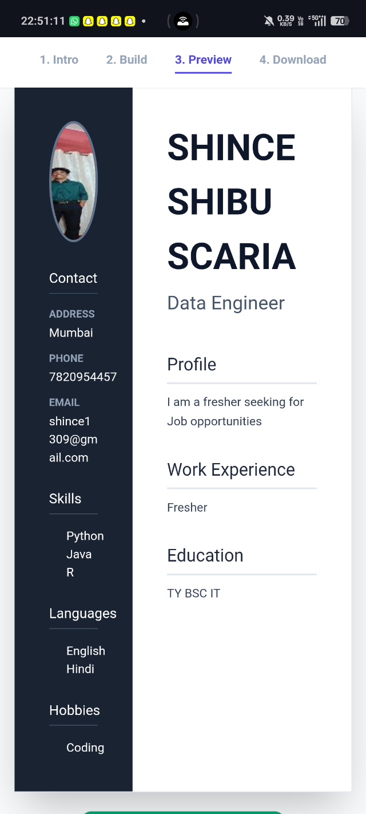
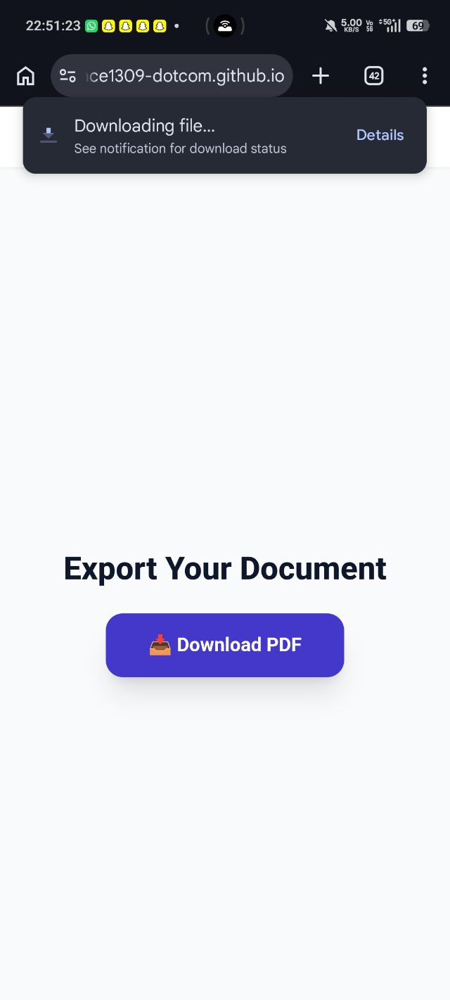
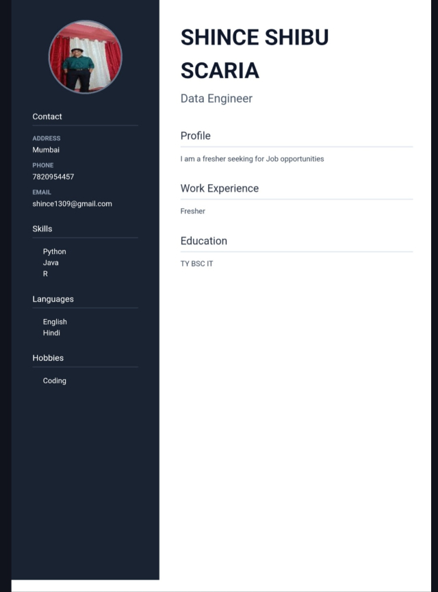

# resume-website
# 📄 Interactive Resume Builder ✨

> **"Transforming your professional journey into a premium document, instantly."**

The Interactive Resume Builder is a fully responsive, client-side web application designed to help students and professionals create beautiful resumes. It features a smart PDF text-extraction engine, live dual-template previews, and high-resolution PDF exporting.

---

## 🎯 Problem Statement
Many students and job seekers struggle to format their resumes professionally[span_2](start_span)[span_2](end_span). This project solves that problem by providing a free, interactive tool that allows users to either manually build a premium resume or automatically parse their existing data from uploaded files into beautiful, standardized templates.

---

## ⚙️ Key Features

*   **Smart PDF Parsing Engine:** Uses zero-dependency binary stream parsing and `pdf.js` to extract text from existing PDFs and intelligently auto-fill form fields.
*   **Dual Premium Templates:** Users can toggle instantly between a Classic Tabular format or a Modern Sidebar layout.
*   **Real-Time Data Management:** Leverages `localStorage` for a seamless, multi-page data passing experience without needing a backend database.
*   **High-Fidelity PDF Export:** Utilizes `html2pdf.js` to convert DOM canvas elements into a downloadable, perfectly scaled A4 PDF document.
*   **Responsive UI/UX:** Built entirely with Tailwind CSS for a modern, mobile-friendly interface.

---

## 📁 Folder Structure

```text
resume-website/
├── index.html          # Welcome page & Smart PDF Upload parser
├── build.html          # Data entry form & template selection
├── preview.html        # Live render of the selected resume template
├── download.html       # html2pdf.js export engine
│
└── README.md           # Project documentation

🛠️ Tech Stack & Architecture
Frontend Structure: Semantic HTML5  
Styling: Tailwind CSS (via CDN)  
Logic & DOM: Vanilla JavaScript (ES6+)  
Libraries:
pdf.js (Mozilla's client-side PDF reader)
html2pdf.js (Client-side HTML-to-PDF rendering)
🚀 Setup Instructions
Because this is a completely client-side architecture hosted on GitHub Pages, no local server setup or installation is required!  
Live Demo:
👉 View the Live Project Here
To run locally:
1. Clone this repository:
git clone [https://github.com/shince1309-dotcom/resume-website.git](https://github.com/shince1309-dotcom/resume-website.git)
2.Open the cloned folder on your computer.
3.Simply double-click index.html to run the application natively in any modern web browser.

## 📸 Project Screenshots

**1. Home Page & Smart Upload**


**2. Interactive Builder Form**


**3. Premium Resume Preview**


**4. Download page**


**5. Resume pdf**



🤖 AI Usage Disclosure
Transparency note per department guidelines:
Generative AI tools were utilized during this project to assist with writing complex JavaScript Regular Expressions (RegEx) for email/phone number extraction, structuring the PDF.js fallback parsing logic, and generating formatting templates for this README documentation.

Project Submitted By: Shince Shibu Scaria
Class: SY BSc IT (Roll No: 5250)
College: St. Andrew's College